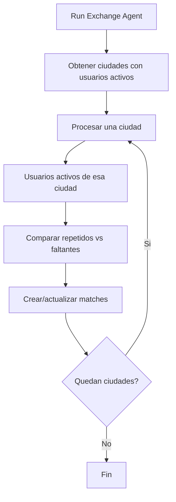

# City Matching Strategy

Fecha: 2026-06-01

## Regla futura

Un usuario solo podra intercambiar cromos con usuarios de su misma ciudad.

## Estado actual preparado

- `User.city` existe en Prisma como campo obligatorio con default temporal `"Cuenca"`.
- Los usuarios existentes fueron verificados con ciudad no vacia.
- Registro de usuario exige seleccionar ciudad.
- Perfil muestra y permite editar ciudad.
- `GET /api/users/me`, `PATCH /api/users/me` y `PUT /api/users/me` exponen/actualizan ciudad.
- `POST /api/auth/register` crea usuarios con ciudad.
- Existe catalogo simple en `lib/cities.ts`.
- Existe indice `@@index([city])` en `User`.

## Como se aplicara

Cuando se implemente el algoritmo de matching, el agente debera limitar candidatos a usuarios activos de la misma ciudad.

Regla tecnica sugerida:

```ts
const users = await prisma.user.findMany({
  where: {
    isActive: true,
    city: currentUser.city
  }
});
```

Para el agente batch, se recomienda agrupar por ciudad y ejecutar el matching dentro de cada grupo:



## Consultas requeridas

1. Obtener usuarios activos agrupados o filtrados por ciudad.
2. Obtener inventarios del album activo solo para usuarios de esa ciudad.
3. Crear matches solo entre pares donde `userA.city === userB.city`.
4. Archivar matches que ya no cumplan:
   - Cambia inventario.
   - Cambia album activo.
   - Cambia ciudad de un usuario.
   - Usuario queda inactivo.

## Indices recomendados

Ya existe:

```prisma
@@index([city])
```

Para escalar el matching por ciudad se recomienda evaluar:

```prisma
@@index([city, isActive])
```

Tambien puede evaluarse un indice compuesto indirecto en consultas de inventario si el agente empieza desde usuarios por ciudad:

```prisma
@@index([userId, albumId, status])
```

Este indice ya esta cubierto por `UserSticker_userId_albumId_status_idx`.

## Impacto esperado

- Reduce candidatos por ciudad y evita matches entre usuarios geograficamente incompatibles.
- Mantiene la privacidad: la ciudad es suficiente para segmentar, sin direcciones exactas.
- Si un usuario cambia de ciudad, sus matches existentes pueden quedar invalidos; el futuro agente debera archivarlos o recalcularlos.
- El costo del matching pasara de comparar todos los usuarios globalmente a comparar grupos por ciudad. El peor caso sigue siendo O(n²) dentro de una ciudad, pero con menor n por segmento.

## No implementado en esta etapa

No se modifico el algoritmo de matching para filtrar por ciudad. Esta etapa solo deja el modelo, formularios, APIs e indices preparados para implementarlo correctamente despues.
