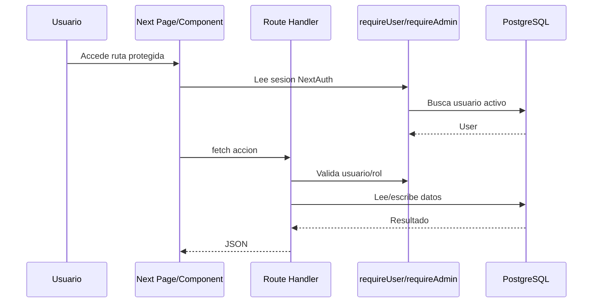
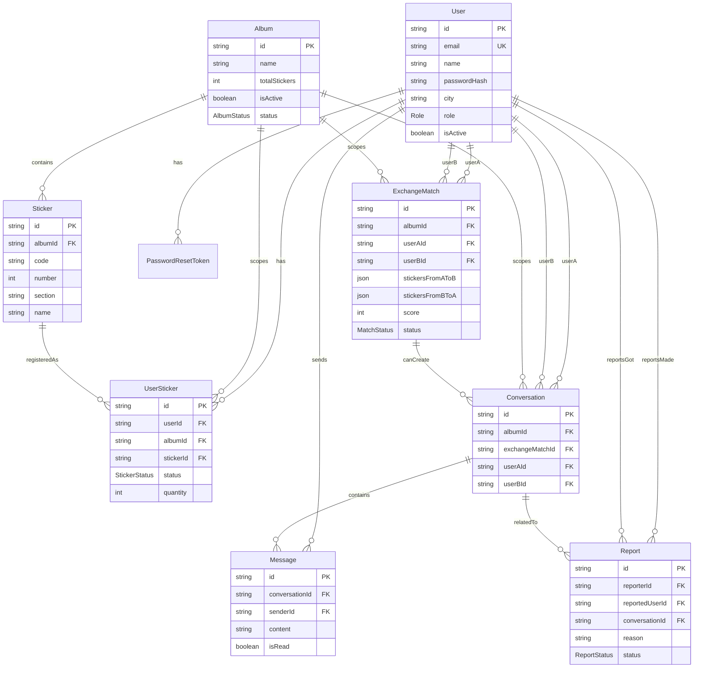

# Cromo Swap - System Audit

Fecha de auditoria: 2026-06-01  
Repositorio auditado: `cromo_swap_cuenca`  
Rol de auditoria: Software Architect, Tech Lead, QA Architect

> Nota: este documento refleja la auditoria inicial previa a la eliminacion de chat y a la preparacion multi-ciudad. Para el estado posterior al cambio funcional, revisar `docs/CHAT_REMOVAL_REPORT.md` y `docs/CITY_MATCHING_STRATEGY.md`.

## Resumen ejecutivo

Cromo Swap es una aplicacion web comunitaria para intercambio de cromos entre coleccionistas de Ecuador, organizada por ciudad. El sistema actual implementa registro/login, recuperacion de contrasena, gestion de inventario por album activo, generacion de matches mediante un agente batch, chat persistido por polling, reportes de seguridad y administracion de usuarios/albumes/reportes.

El proyecto compila y pasa lint/test en el entorno actual:

- `npm test`: pasa 1 archivo, 1 prueba.
- `npm run lint`: sin warnings ni errores.
- `npm run build`: build de produccion exitoso con 40 rutas App Router.

Nivel de salud estimado: **72/100**.

Estado para continuar desarrollo: **listo con condiciones**. La base funcional existe y el build esta sano, pero antes de crecer se recomienda cerrar brechas de pruebas, observabilidad, contratos API, rate limiting y escalabilidad del agente de matches.

## 1. Inventario del proyecto

### Arquitectura general

Arquitectura monolitica full-stack con Next.js App Router:

- Frontend: paginas `app/*`, componentes React y TailwindCSS.
- Backend: Route Handlers en `app/api/*`.
- Dominio compartido: `lib/*`.
- Base de datos: PostgreSQL via Prisma, orientada a Neon serverless.
- Auth: NextAuth credentials con sesiones JWT.
- Jobs: Vercel Cron contra `/api/cron/exchange-agent`.
- Mobile/PWA: manifest, service worker y wrapper Capacitor Android apuntando a la URL web.

```mermaid
flowchart TD
  Browser[Web/PWA/Android WebView] --> Next[Next.js App Router]
  Next --> Pages[Server Pages]
  Next --> API[API Route Handlers]
  Pages --> Auth[NextAuth Session Helpers]
  API --> Auth
  API --> Prisma[Prisma Client]
  Pages --> Prisma
  Prisma --> Neon[(PostgreSQL / Neon)]
  Cron[Vercel Cron] --> AgentAPI[/api/cron/exchange-agent]
  AgentAPI --> ExchangeAgent[lib/exchange-agent]
  ExchangeAgent --> Prisma
  ForgotPassword[/api/auth/forgot-password] --> Resend[Resend Email API]
```

### Stack tecnologico

- Runtime: Node.js `22.x` (`package.json`).
- Framework: Next.js `14.2.x` App Router.
- UI: React `18.3.x`, TailwindCSS `3.4.x`.
- Lenguaje: TypeScript `5.7.x`, `strict: true`.
- ORM: Prisma `5.22.x`.
- DB: PostgreSQL, documentada para Neon.
- Auth: NextAuth `4.24.x`, `@auth/prisma-adapter` instalado pero no usado en la configuracion actual.
- Validacion: Zod.
- Password hashing: bcryptjs.
- Tests: Vitest.
- Mobile: Capacitor 8 Android.
- Deploy: Vercel, Vercel Cron.

### Frameworks y librerias principales

- `next`, `react`, `react-dom`: aplicacion web.
- `next-auth`: autenticacion por credentials y JWT.
- `@prisma/client`, `prisma`, `@prisma/adapter-neon`, `@neondatabase/serverless`: acceso a datos.
- `zod`: validaciones de requests.
- `bcryptjs`: hash de contrasenas.
- `tailwindcss`, `postcss`, `autoprefixer`, `clsx`: estilos.
- `vitest`: pruebas unitarias.
- `@capacitor/*`: empaquetado Android/WebView.

### Estructura de carpetas

- `app/`: rutas frontend y API handlers.
- `app/(public)/`: login, registro y recuperacion de contrasena.
- `app/api/`: endpoints de auth, usuarios, albumes, cromos, inventario, matches, chat, reportes, admin y cron.
- `app/admin/`: pantallas administrativas.
- `components/`: componentes cliente/servidor reutilizables.
- `lib/`: auth, dominio, Prisma, validadores, agente de intercambio, password reset y administracion de albumes.
- `prisma/`: schema, migraciones y seed.
- `tests/`: pruebas Vitest.
- `public/`: PWA manifest, service worker, iconos y APK publicado.
- `android/`: proyecto Android generado por Capacitor.
- `scripts/`: utilidades de keystore y release APK.

### Flujo principal de negocio

1. Usuario se registra y elige su ciudad (`/register`, `/api/auth/register`).
2. Usuario inicia sesion con email/contrasena (`NextAuth credentials`).
3. Admin crea o activa un album con catalogo de cromos por secciones.
4. Usuario marca cromos que tiene y repetidos en el album activo (`/album`, `/repeated`, `/missing`).
5. El agente de intercambio compara repetidos vs faltantes entre usuarios y crea `ExchangeMatch`.
6. Usuario revisa matches sugeridos y abre conversacion.
7. Usuarios intercambian mensajes en chat interno con polling.
8. Usuario puede reportar una conversacion; admin gestiona reportes y usuarios.

### Dependencias criticas

- `DATABASE_URL`: requerida para la app y Prisma Client.
- `DIRECT_URL`: requerida para migraciones Prisma.
- `NEXTAUTH_SECRET`: requerida para seguridad de sesiones.
- `CRON_SECRET`: requerida para proteger el cron del agente.
- `RESEND_API_KEY`: requerida para enviar correos de recuperacion.
- Vercel Cron: ejecuta el agente diariamente.
- Neon/PostgreSQL: persistencia principal.

### Integraciones externas

- Neon/PostgreSQL: base de datos.
- Resend API: envio de emails de recuperacion (`lib/password-reset.ts`).
- Vercel Cron: invocacion programada (`vercel.json`).
- Capacitor Android: app Android que carga `https://cromoswapcuenca.vercel.app`.

### Configuracion de ambientes

Archivos relevantes:

- `.env.example`: plantilla de variables.
- `.env`: existe localmente, no se audito su contenido por seguridad.
- `next.config.mjs`: configura `serverActions.allowedOrigins` para `localhost:3000`.
- `vercel.json`: cron diario `0 12 * * *`.
- `capacitor.config.ts`: Android/WebView contra produccion.
- `tsconfig.json`: TypeScript strict.
- `.eslintrc.json`: `next/core-web-vitals`.

### Variables de entorno utilizadas

Detectadas en codigo y Prisma:

- `DATABASE_URL`
- `DIRECT_URL`
- `NEXTAUTH_SECRET`
- `NEXTAUTH_URL`
- `NEXT_PUBLIC_APP_URL`
- `CRON_SECRET`
- `RESEND_API_KEY`
- `SEED_ADMIN_EMAIL`
- `SEED_ADMIN_PASSWORD`
- `NODE_ENV`
- `ANDROID_VERSION_BUMP`
- `ANDROID_UPDATE_REQUIRED`

## 2. Mapa funcional

| Funcionalidad | Estado | Componentes/Pantallas | APIs | Base de datos |
|---|---:|---|---|---|
| Registro de usuarios | Completa basica | `RegisterForm`, `/register` | `POST /api/auth/register` | `User` |
| Login | Completa basica | `LoginForm`, `/login`, `lib/auth.ts` | `NextAuth /api/auth/[...nextauth]` | `User` |
| Recuperacion de contrasena | Parcial operativa | `ForgotPasswordForm`, `ResetPasswordForm` | `/api/auth/forgot-password`, `/api/auth/reset-password` | `PasswordResetToken`, `User` |
| Perfil | Parcial | `/profile`, `ProfileForm` | `GET/PATCH /api/users/me` | `User`, stats de inventario/mensajes |
| Gestion de inventario | Completa basica | `AlbumScreen`, `InventoryManager`, `/album`, `/repeated`, `/missing` | `/api/user-stickers`, `/api/user-stickers/[id]`, `/api/stickers` | `Album`, `Sticker`, `UserSticker` |
| Faltantes | Parcial | `/missing`, filtro UI | Backend acepta `MISSING`, UI calcula faltantes por ausencia | `UserSticker` |
| Repetidos | Completa basica | `/repeated`, controles +/- | `/api/user-stickers` | `UserSticker.quantity` |
| Generacion de matches | Parcial | `RunAgentButton`, cron | `/api/admin/run-agent`, `/api/cron/exchange-agent`, `/api/matches` | `ExchangeMatch`, `UserSticker` |
| Visualizacion de matches | Completa basica | `/matches`, `MatchesList` | `GET /api/matches`, `POST /api/conversations` | `ExchangeMatch`, `Conversation` |
| Chat | Parcial operativa | `/chat`, `/chat/[conversationId]`, `ChatClient` | `/api/conversations`, `/api/messages`, `/api/messages/read` | `Conversation`, `Message` |
| Reportes | Completa basica | Report form en chat, `/admin/reports` | `/api/reports`, `/api/admin/reports`, `/api/admin/reports/[id]` | `Report` |
| Administracion de usuarios | Parcial | `/admin/users`, admin actions | `/api/admin/users`, `/api/admin/users/[id]`, `/password` | `User` |
| Administracion de albumes | Parcial avanzada | `/admin/albums`, admin actions | `/api/admin/albums`, `/api/admin/albums/[id]`, `/restart-season` | `Album`, `Sticker`, cascadas |
| Administracion de cromos sueltos | Parcial/API-only | Sin pantalla dedicada encontrada | `/api/admin/stickers`, `/api/admin/stickers/seed` | `Sticker` |
| Notificaciones | No implementada como push/email | Contador de no leidos | `GET /api/users/me` | `Message.isRead` |
| Busquedas | Parcial | inventario local, admin users | `/api/stickers?q=`, `/api/admin/users?q=` | `Sticker`, `User` |

## 3. Mapa tecnico

### Frontend

Rutas publicas:

- `/`: landing.
- `/login`
- `/register`
- `/forgot-password`
- `/reset-password`

Rutas protegidas por middleware:

- `/dashboard`
- `/album`
- `/repeated`
- `/missing`
- `/matches`
- `/chat`
- `/chat/[conversationId]`
- `/profile`
- `/admin/*`

Componentes clave:

- `components/auth-forms.tsx`
- `components/inventory-manager.tsx`
- `components/album-screen.tsx`
- `components/matches-list.tsx`
- `components/chat-client.tsx`
- `components/admin-actions.tsx`
- `components/header.tsx`
- `components/providers.tsx`

### Backend y APIs

APIs de usuario:

- `POST /api/auth/register`
- `POST /api/auth/forgot-password`
- `POST /api/auth/reset-password`
- `GET /api/users/me`
- `PATCH /api/users/me`
- `GET /api/albums`
- `GET /api/albums/active`
- `GET /api/stickers`
- `GET/POST /api/user-stickers`
- `PATCH/DELETE /api/user-stickers/[id]`
- `GET /api/matches`
- `GET/POST /api/conversations`
- `GET/POST /api/messages`
- `PATCH /api/messages/read`
- `POST /api/reports`

APIs admin:

- `GET/POST /api/admin/albums`
- `PATCH/DELETE /api/admin/albums/[id]`
- `POST /api/admin/albums/restart-season`
- `GET /api/admin/users`
- `PATCH/DELETE /api/admin/users/[id]`
- `POST /api/admin/users/[id]/password`
- `GET /api/admin/reports`
- `PATCH /api/admin/reports/[id]`
- `GET /api/admin/matches`
- `POST /api/admin/run-agent`
- `POST /api/admin/stickers`
- `POST /api/admin/stickers/seed`

Job:

- `GET/POST /api/cron/exchange-agent`, protegido por `Authorization: Bearer <CRON_SECRET>`.

### Servicios y dominio

- `lib/auth.ts`: configuracion NextAuth, `requireUser`, `requireAdmin`.
- `lib/domain.ts`: album activo y ordenamiento de pares de usuarios.
- `lib/exchange-agent.ts`: calculo de matches.
- `lib/album-admin.ts`: generacion de catalogo, limpieza de datos por album, eliminacion de grafo.
- `lib/password-reset.ts`: token y email de reset.
- `lib/validators.ts`: schemas Zod.
- `lib/http.ts`: respuestas JSON y manejo basico de errores.
- `lib/prisma.ts`: Prisma singleton y retry para conexiones cerradas.

### Middlewares

`middleware.ts` usa `withAuth`:

- Requiere token para rutas privadas.
- Redirige rutas `/admin/*` a `/dashboard` si `token.role !== "ADMIN"`.

### WebSockets

No hay WebSockets. El chat usa polling cada 8 segundos desde `ChatClient`.

### Seguridad, autenticacion y autorizacion

- Auth: NextAuth credentials + bcrypt + JWT.
- Autorizacion de paginas: middleware + llamadas server-side a `requireUser`/`requireAdmin`.
- Autorizacion API: helpers `requireUser` y `requireAdmin` en handlers.
- Reset password: token aleatorio, hash SHA-256 en DB, expiracion 1 hora, uso unico.
- Cron: secreto bearer.
- Datos sensibles: UI evita telefonos/direcciones; modelo no contiene esos campos.



## 4. Deteccion de deuda tecnica

### Critico

No se detectaron fallos criticos que impidan compilar o ejecutar el sistema en produccion basica.

### Alto

1. **Cobertura de pruebas muy baja.** Solo existe `tests/exchange-agent.test.ts` con un caso negativo. No hay pruebas para auth, inventario, matches reales, chat, admin, migraciones ni APIs.
2. **Agente de matches O(n²).** `lib/exchange-agent.ts` compara todos los pares de usuarios activos y carga inventarios en memoria. Riesgo de timeout/costo alto al crecer la comunidad.
3. **Sin rate limiting ni proteccion anti-abuso en auth/mensajes/reportes.** Endpoints de login, registro, forgot password, mensajes y reportes no aplican limites por IP/usuario.
4. **Sesiones JWT pueden quedar obsoletas si cambia `isActive` o `role`.** Middleware decide con claims del token; las paginas/APIs revalidan DB via `requireUser`, pero la UX puede permitir navegar hasta que una llamada server-side falle.
5. **Frontera frontend/API inconsistente.** Varias paginas consultan Prisma directamente mientras existen endpoints equivalentes (`/dashboard`, `/profile`, `/chat`, admin). Esto duplica logica de datos y dificulta pruebas contractuales.

### Medio

1. **Endpoints API-only o potencialmente muertos.** `/api/admin/stickers`, `/api/admin/stickers/seed`, `/api/admin/matches`, `/api/albums` no tienen pantalla/consumo claro en el UI auditado.
2. **`@auth/prisma-adapter`, `@neondatabase/serverless`, `@prisma/adapter-neon` instalados pero no usados directamente.** El proyecto usa NextAuth JWT sin adapter y PrismaClient normal.
3. **Manejo de errores heterogeneo.** Algunos catch devuelven `forbidden()` para cualquier error, ocultando errores reales como falta de album activo o fallos DB.
4. **`MISSING` en DB no coincide plenamente con UI.** La UI trata faltantes como ausencia de `HAVE/REPEATED`; backend permite crear `MISSING`, pero el flujo visual principal no registra faltantes explicitamente.
5. **Admin puede cambiar roles por API.** `PATCH /api/admin/users/[id]` acepta `role`, pero la UI no expone cambio de rol. Debe definirse politica y auditoria.
6. **No hay paginacion de mensajes ni conversaciones.** `GET /api/messages` carga toda la conversacion.
7. **No hay auditoria de acciones administrativas.** Activar albumes, eliminar albumes, desactivar usuarios y cambiar contrasenas no quedan registrados en una tabla de auditoria.
8. **El endpoint de reset email no falla si Resend no esta configurado.** Es intencional para no revelar usuarios, pero operacionalmente puede ocultar que no se envio correo.

### Bajo

1. **Codigo comentado o TODO/FIXME relevantes:** no se encontraron TODO/FIXME de aplicacion con `rg`; los comentarios detectados son de Gradle/migraciones.
2. **Iconos inline SVG en `InventoryManager`.** No es deuda funcional, pero hay duplicacion visual manual.
3. **Textos sin tildes por estilo ASCII.** Consistente con el repo, no bloqueante.
4. **`next.config.mjs` solo permite server actions desde localhost aunque no se detecto uso real de Server Actions.**

## 5. Revision de calidad

### Hallazgos con evidencia

1. **Build sano.** `npm run build` compila Next, genera Prisma Client y lista todas las rutas sin errores.
2. **Lint sano.** `npm run lint` reporta cero errores/warnings.
3. **Pruebas insuficientes.** `npm test` pasa solo 1 prueba; cobertura real aproximada: muy baja.
4. **Validacion de input razonable.** `lib/validators.ts` usa Zod para registro, login, reset, perfil, album, stickers, user-stickers, conversaciones, mensajes y reportes.
5. **Manejo de excepciones basico.** `lib/http.ts` centraliza `badRequest`, `forbidden`, `notFound`, pero algunos handlers capturan cualquier error y responden 403.
6. **Riesgo de abuso.** No se detecto rate limiting, CAPTCHA, cooldown por forgot password, ni quotas para mensajes/reportes.
7. **Riesgo de integridad funcional en albumes.** `PATCH /api/admin/albums/[id]` puede limpiar inventarios/matches/chats si regenera catalogo en borrador con datos existentes. La UI advierte, pero requiere pruebas.
8. **Escalabilidad de chat limitada.** Polling cada 8 segundos y mensajes sin paginacion puede ser suficiente al inicio, pero no escala bien.
9. **Mantenibilidad media.** La logica de negocio esta bastante separada en `lib`, pero existe duplicacion de queries de stats entre `/dashboard`, `/profile` y `/api/users/me`.

## 6. Revision de base de datos

### Modelo actual

Modelos Prisma:

- `User`
- `PasswordResetToken`
- `Album`
- `Sticker`
- `UserSticker`
- `ExchangeMatch`
- `Conversation`
- `Message`
- `Report`

Enums:

- `Role`: `USER`, `ADMIN`
- `StickerStatus`: `HAVE`, `REPEATED`, `MISSING`
- `MatchStatus`: `SUGGESTED`, `DISMISSED`, `ARCHIVED`
- `ReportStatus`: `OPEN`, `REVIEWING`, `RESOLVED`, `DISMISSED`
- `AlbumStatus`: `DRAFT`, `ACTIVE`, `ARCHIVED`

### Relaciones e indices

- `User.email` unico.
- `Sticker`: unico por `(albumId, code, number)`.
- `UserSticker`: unico por `(userId, stickerId)`.
- `ExchangeMatch`: unico por `(albumId, userAId, userBId)`.
- `Conversation`: unico por `(userAId, userBId, exchangeMatchId)`.
- Indices principales en ciudad, album activo/status, sticker por album/seccion, inventario por usuario/album/status, matches por album/score, mensajes por conversacion/fecha y reportes por status/fecha.

### Migraciones

Migraciones existentes:

- `20260502232749_init`: modelo inicial.
- `20260503001000_album_status_and_section_codes`: agrega estados de album y codigos de seccion.
- `20260503223000_password_reset_tokens`: tokens de reset.
- `20260503233000_remove_user_zone`: remueve zona de usuario.

### Riesgos de integridad

- No hay constraint DB que garantice un solo album activo. Se controla por transacciones de aplicacion.
- `Conversation.albumId` y `exchangeMatchId` son nullable con `SetNull`; preserva historico, pero puede perder contexto de album/match al borrar.
- `ExchangeMatch.stickersFromAToB` y `stickersFromBToA` son JSON; no hay integridad referencial sobre cromos guardados dentro del JSON.
- `UserSticker.quantity` permite minimo por validacion Zod, pero no se observa constraint DB `CHECK quantity > 0`.
- `Message.content` y `Report.reason` dependen de validacion app; no hay constraints de longitud en DB.

### Diagrama ER



## 7. Estado de pruebas

### Tests encontrados

- Unit tests: 1 archivo, `tests/exchange-agent.test.ts`.
- Integration tests: no encontrados.
- E2E tests: no encontrados.
- Android tests: existen placeholders generados por Capacitor/Gradle, no cubren negocio.

### Cobertura aproximada

No hay reporte de cobertura configurado. Por inspeccion, cobertura funcional aproximada: **menor al 5%**.

### Areas sin pruebas

- Registro/login/roles/sesiones.
- Recuperacion de contrasena.
- Inventario: altas, bajas, repetidos, edge cases.
- Generacion de matches con datos reales y obsolescencia.
- Conversaciones, mensajes, lectura y reportes.
- Admin de usuarios y albumes.
- Migraciones y seed.
- Middleware de rutas protegidas.
- Seguridad de cron.
- UI/E2E de flujos criticos.

### Riesgo

El sistema puede seguir desarrollandose, pero cualquier cambio en dominio o DB tendra alto riesgo de regresion por falta de pruebas de contrato y flujo.

## 8. Estado de CI/CD

### Pipelines

No se encontro directorio `.github` ni pipeline CI en el repositorio. La validacion automatica depende de comandos locales/Vercel.

### Build

- `npm run build`: `prisma generate && next build`.
- Build local exitoso.

### Deploy

- Vercel documentado en `README.md`.
- `vercel.json` define cron diario.
- No hay configuracion de migraciones automatizadas en CI/CD.

### Quality gates

- `npm run lint`: disponible y pasa.
- `npm test`: disponible y pasa, pero cobertura insuficiente.
- Typecheck ocurre dentro de `next build`.
- No hay cobertura minima, SAST, dependency audit, format check ni pruebas E2E en pipeline.

### Problemas encontrados

- Ausencia de pipeline versionado.
- Migraciones/seed dependen de ejecucion manual.
- No hay gates de cobertura ni pruebas de integracion.
- No hay estrategia explicita de deploy Android en CI.

## 9. Funcionalidades incompletas o parcialmente implementadas

1. **Notificaciones:** solo contador de no leidos; no hay push, email, realtime ni preferencias.
2. **Chat realtime:** implementado con polling; no WebSocket/SSE.
3. **Faltantes explicitos:** backend soporta `MISSING`, pero UI calcula faltantes por ausencia y no registra `MISSING` como accion primaria.
4. **Dismiss de matches:** enum `DISMISSED` existe, pero no se encontro accion UI/API especifica para descartar match.
5. **Administracion de cromos individual:** endpoints existen, pero no hay pantalla admin dedicada.
6. **Admin matches:** endpoint `/api/admin/matches` existe, pero no se encontro pagina admin de matches.
7. **Auditoria administrativa:** no hay historial de cambios.
8. **Moderacion:** reportes existen, pero no hay workflow avanzado de sanciones, notas internas o bloqueo de mensajes.
9. **Busquedas avanzadas:** inventario busca localmente sobre los primeros datos cargados; API de stickers tiene busqueda, pero la UI principal no la usa para paginar/cargar remoto.
10. **Observabilidad:** no hay trazas, metricas ni alertas.

## 10. Recommended Next Steps

### Prioridad 1

1. **Agregar pruebas de dominio y API criticas.**  
   Por que: reduce regresiones antes de nuevas features.  
   Riesgo si no se hace: cambios en inventario/matches/chat pueden romper flujos core sin deteccion.  
   Esfuerzo: 2-4 dias para suite inicial.

2. **Proteger endpoints sensibles con rate limiting/cooldowns.**  
   Por que: registro, login, forgot password, mensajes y reportes son superficies de abuso.  
   Riesgo si no se hace: spam, fuerza bruta, abuso de Resend y carga DB.  
   Esfuerzo: 1-2 dias.

3. **Definir contrato del agente de matches y probar escenarios reales.**  
   Por que: es el nucleo del intercambio.  
   Riesgo si no se hace: matches incorrectos, duplicados, obsoletos o costosos.  
   Esfuerzo: 2-3 dias.

4. **Agregar CI basico.**  
   Por que: cada PR/deploy debe ejecutar lint, test y build.  
   Riesgo si no se hace: regresiones llegan a produccion.  
   Esfuerzo: 0.5-1 dia.

### Prioridad 2

1. **Refactorizar stats compartidas a un servicio de dominio.**  
   Por que: `/dashboard`, `/profile` y `/api/users/me` duplican queries.  
   Riesgo si no se hace: inconsistencias de metricas.  
   Esfuerzo: 1 dia.

2. **Paginacion de chat y administracion.**  
   Por que: mensajes y reportes pueden crecer.  
   Riesgo si no se hace: respuestas lentas y alto consumo memoria.  
   Esfuerzo: 1-2 dias.

3. **Constraint/logica fuerte para un solo album activo.**  
   Por que: hoy depende de aplicacion.  
   Riesgo si no se hace: estados invalidos por concurrencia o cambios manuales DB.  
   Esfuerzo: 1-2 dias.

4. **Clarificar modelo de faltantes.**  
   Por que: `MISSING` existe en DB pero la UI usa ausencia.  
   Riesgo si no se hace: confusion en matches y reportes de inventario.  
   Esfuerzo: 0.5-1 dia de decision + ajustes.

### Prioridad 3

1. **Observabilidad y auditoria.**  
   Por que: soporte operativo y seguridad admin.  
   Riesgo si no se hace: dificil investigar errores o abuso.  
   Esfuerzo: 2-4 dias.

2. **Optimizar agente para crecimiento.**  
   Por que: O(n²) no escala indefinidamente.  
   Riesgo si no se hace: timeouts del cron y matches incompletos.  
   Esfuerzo: 3-7 dias segun volumen objetivo.

3. **Notificaciones y realtime.**  
   Por que: mejora UX de chat/matches.  
   Riesgo si no se hace: experiencia aceptable pero no inmediata.  
   Esfuerzo: 3-7 dias.

4. **Revisar dependencias no usadas.**  
   Por que: reduce superficie de mantenimiento.  
   Riesgo si no se hace: dependencias innecesarias y posibles CVEs.  
   Esfuerzo: 0.5 dia.

## Conclusiones

### Que hace exactamente hoy

Permite a usuarios de diferentes ciudades de Ecuador registrarse, iniciar sesion, registrar cromos del album activo, marcar repetidos, ver matches generados por un agente, iniciar chats, enviar mensajes y reportar problemas. Admin puede crear/activar/editar/eliminar albumes, ejecutar el agente, gestionar usuarios, cambiar contrasenas y revisar reportes.

### Que partes estan completas

- Base web full-stack funcional.
- Modelo multi-album.
- Auth credentials/JWT.
- Inventario basico.
- Matches batch.
- Chat persistido por polling.
- Reportes basicos.
- Admin basico.
- Build/lint/test ejecutables.

### Que partes estan incompletas

- Pruebas de flujos reales.
- CI/CD versionado.
- Rate limiting.
- Notificaciones/realtime.
- Paginacion de chat.
- Auditoria admin.
- Gestion UI completa de cromos/admin matches.
- Escalabilidad del agente.

### Preparacion para continuar desarrollo

El sistema esta **apto para continuar** si la siguiente etapa empieza por hardening tecnico y pruebas del core. No se recomienda agregar funcionalidades grandes encima del estado actual sin antes cubrir Prioridad 1.
